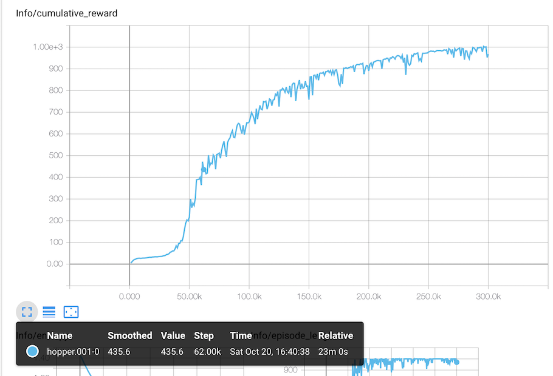
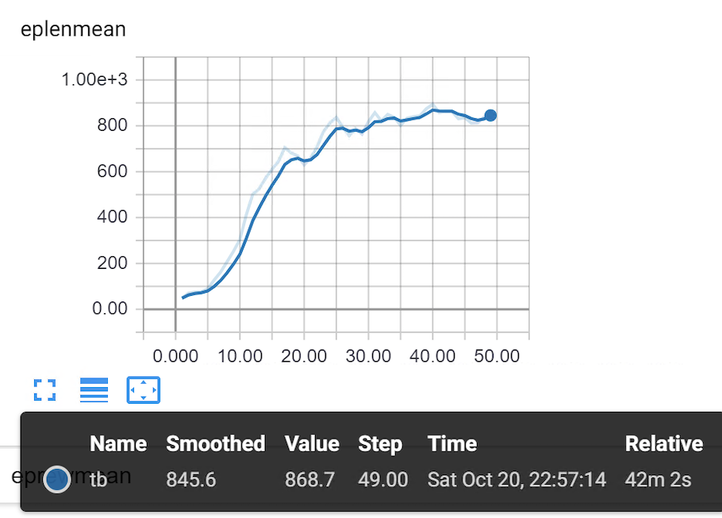
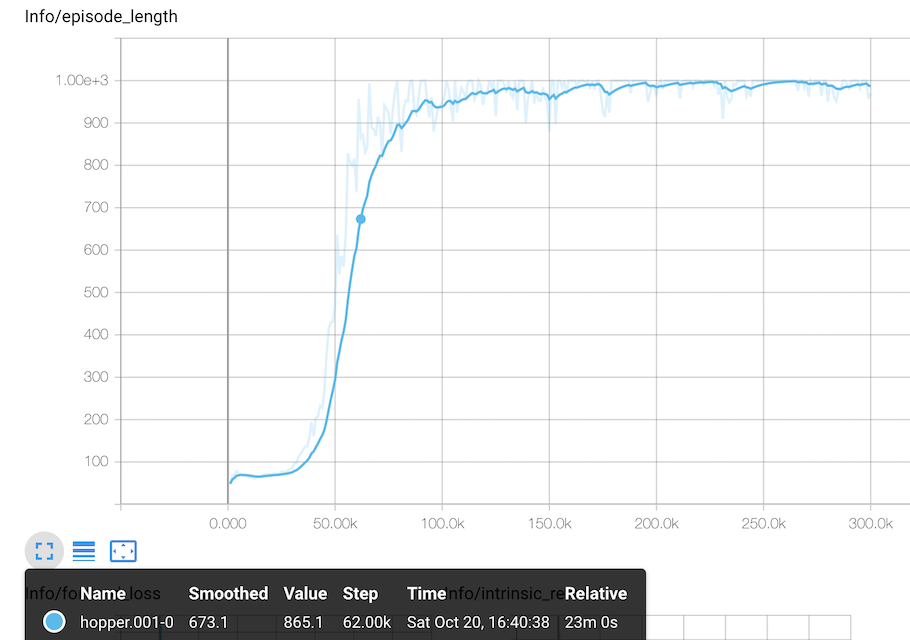
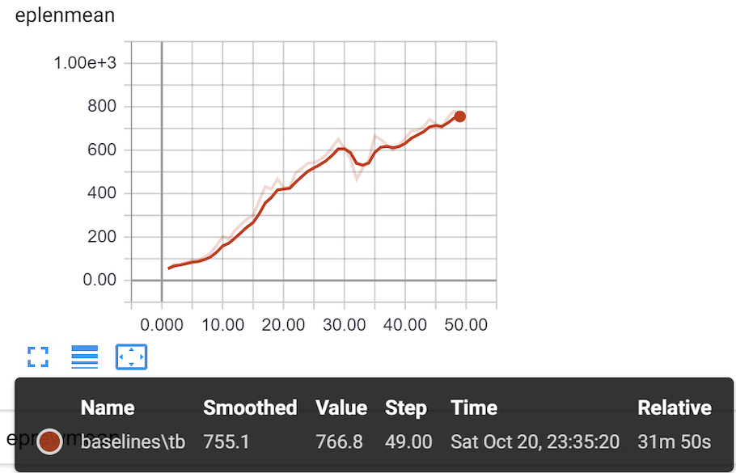
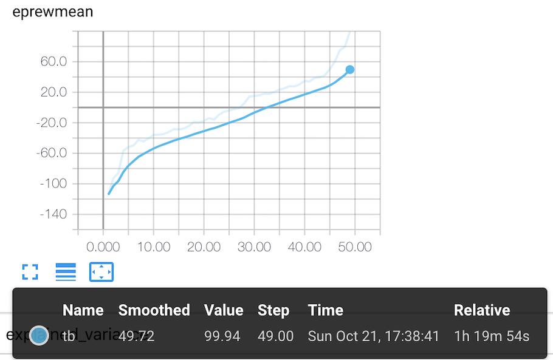
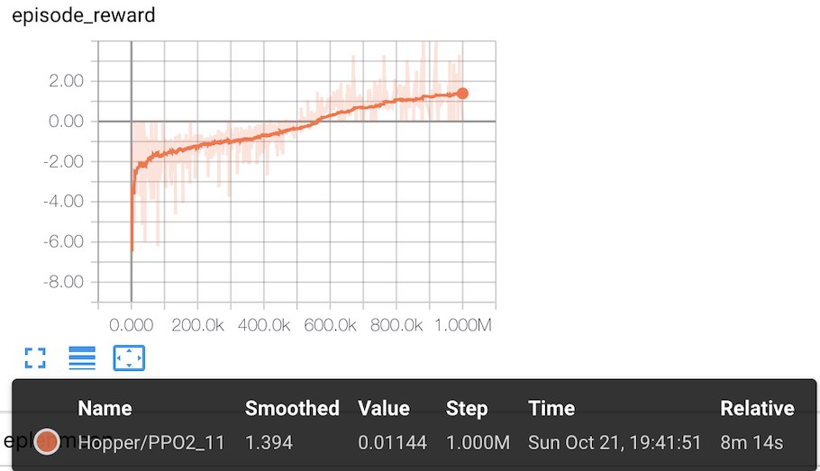
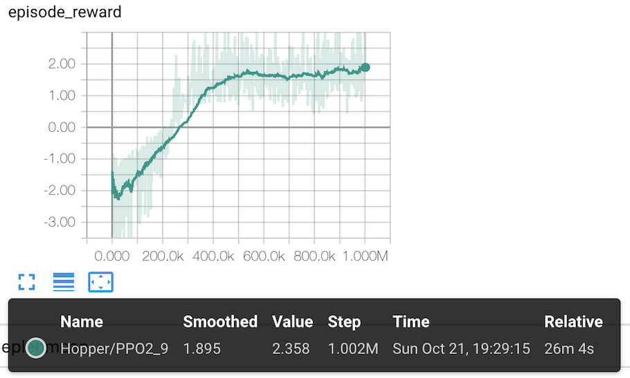
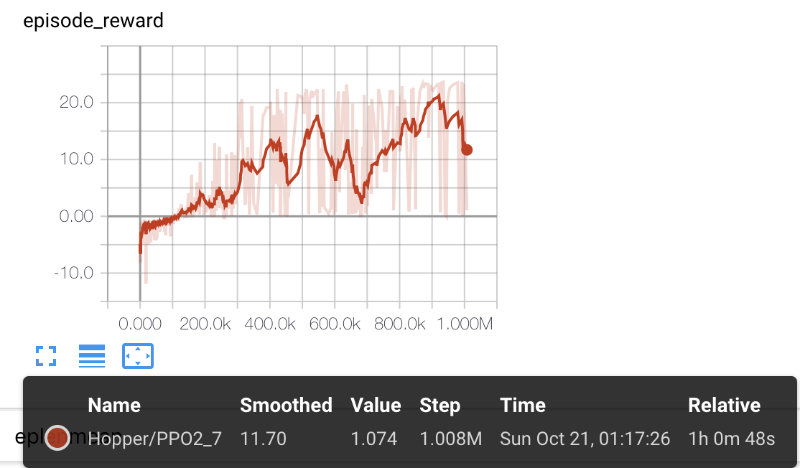
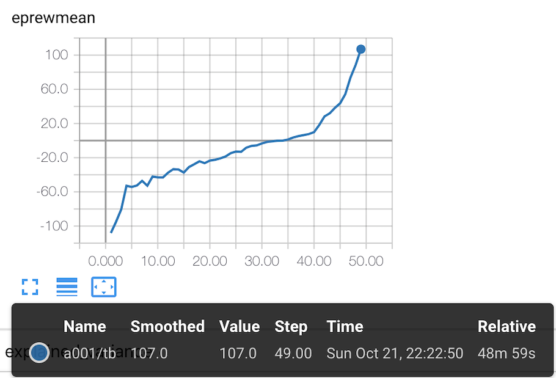
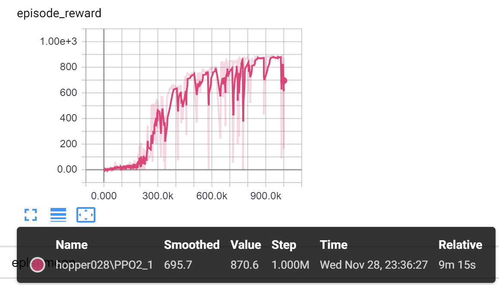

# MarathonEnvs + OpenAi.Baselines

Explority implementation of 
* MarathonEnvs
* ml-agents
* openai.baselines
* stable.baselines


### source versions
* MarathonEnvs
* ml-agents = 0.5.1
* openai.baselines = 7bfbcf1
* stable.baselines = [v2.2.0](https://github.com/hill-a/stable-baselines/tree/v2.2.0)

-----
### Install
* Clone this repro (ideally from a release version)
* [Download](https://github.com/Sohojoe/MarathonEnvsBaselines/releases/tag/v1.0.0) / Unzip prebuilt MatathonEnvs into the `env` folder 
* pip installs
```
# ml-agents
cd ml-agents
pip install -e .
# gym-unity
cd gym-unity
pip install -e .
# baselines - does not need to be installed
# stable_baselines 
cd stable_baselines
pip install -e .

```
-----
### Status-Hopper

|  | Win10 | MacOS | Notes |
|---|---|---|---|
| ml-agents-ppo |  | **score=435** **(23min)** | 
| baselines-ppo2 multiagents | **score=943** **(7min)** | **score=860** **(11min)** | 16 agents, nsteps=128 
| baselines-ppo2 multiagents non-normalized | **score=774** **(7min)** | **score=450** **(11min)** | 16 agents, nsteps=128 
| baselines-ppo2 MPIx4 | **score=594** (42min) | score=583 (82min) | Having problems with mpi + ml-agents on windows. Save is broken for normalized agents
| baselines-ppo2 single agent | score=328 (31min) | | need to check if 1m steps with mpi == 1m steps with single agent as not clear why it would be faster. Save is broken for normalized agents
| baselines-ppo2 MPIx4 TfRunningMeanStd | | | TfRunningMeanStd fixes save / load but trains slower
| baselines-ppo2 single agent TfRunningMeanStd | score=95 (40m) | score=107 (49min) | TfRunningMeanStd fixes save / load but trains slower
| baselines-ppo2 MPIx4 non-normalized | | score=50 (79min) | (should try training for more steps)


### Status-Walker

|  | Win10 | MacOS | Notes |
|---|---|---|---|
| ml-agents-ppo |  |  | 
| baselines-ppo2 multiagents | **score=1371** **(8min)** | **score=1439** **(12min)**  | 
| baselines-ppo2 multiagents non-normalized | | **score=1005** **(12min)** | 16 agents, nsteps=128 


-----
# OpenAI.Baselines
### Example command lines

#### To enable Tensorboard
```
# MacOS: 
export OPENAI_LOG_FORMAT='stdout,log,csv,tensorboard' 
export OPENAI_LOGDIR=summaries

# Win10:
set OPENAI_LOG_FORMAT=stdout,log,csv,tensorboard
set OPENAI_LOGDIR=summaries
```

#### ppo2 for 1m steps
```
# MacOS training:
# multiagent
python -m baselines.run_multiagent_unity --alg=ppo2 --env=./envs/hopper-x16 --num_timesteps=1e6 --save_path=./models/hopper_1m_ppo2

# mpi creates 4 agents
mpiexec -n 4 python -m baselines.run_unity --alg=ppo2 --env=./envs/hopper --num_timesteps=1e6 --save_path=./models/hopper_1m_ppo2

# baslines creates 4 agents
python -m baselines.run_unity --alg=ppo2 --env=./envs/hopper --num_timesteps=1e6 --num_env=4 --save_path=./models/hopper_1m_ppo2

# Play: 
python -m baselines.run_unity --alg=ppo2 --env=./envs/hopper-run —num_timesteps=0 --load_path=./models/hopper_1m_ppo2 --play

# Windows training:
# multiagent
python -m baselines.run_multiagent_unity --alg=ppo2 --env="envs\hopper-x16\Unity Environment.exe" --num_timesteps=1e6 --save_path=models\hopper_1m_ppo2

mpiexec -n 4 python -m baselines.run_unity --alg=ppo2 --env="envs\hopper\Unity Environment.exe" --num_timesteps=1e6 --save_path=models\hopper_1m_ppo2

# Windows Play: 
python -m baselines.run_unity --alg=ppo2 --env="envs\hopper-run\Unity Environment.exe" —num_timesteps=0 --load_path=models\hopper_1m_ppo2 --play

python -m baselines.run_unity --alg=ppo2 --env="envs\walker-run\Unity Environment.exe" —num_timesteps=0 --load_path=models\walker_1m_ppo2 --play

```

#### acktr
```
mpiexec -n 4 python -m baselines.run_unity --alg=acktr --env=./envs/walker --num_timesteps=1e6  --save_path=./models/walker_1m_acktr

python -m baselines.run_unity --alg=acktr --env=./envs/walker-run --num_timesteps=0 --load_path=./models/walker_1m_acktr --play
```

#### acer
```
mpiexec -n 4 python -m baselines.run_unity --alg=acer --env=./envs/walker --num_timesteps=1e6  --save_path=./models/walker_1m_acer
```

#### a2c
```
mpiexec -n 4 python -m baselines.run_unity --alg=a2c --env=./envs/walker --num_timesteps=1e6  --save_path=./models/walker_1m_a2c
```


#### gail
```
mpiexec -n 4 python -m baselines.run_unity --alg=gail --env=./envs/walker --num_timesteps=1e6  --save_path=./models/walker_1m_gail
```


## example command lines - not working yet
#### her
```
mpiexec -n 4 python -m baselines.run_unity --alg=her --env=./envs/walker --num_timesteps=1e6  --save_path=./models/walker_1m_her

python -m baselines.run_unity --alg=her --env=./envs/walker-run --num_timesteps=0 --load_path=./models/walker_1m_her —-play
```


-----
# ml-agents

#### MacOS train using marathon_envs_config.yaml
```
mlagents-learn config/marathon_envs_config.yaml --train --worker-id=10 --env=./envs/hopper-x16 --run-id=hopper.001

set CUDA_VISIBLE_DEVICES=-1 & mlagents-learn config/marathon_envs_config.yaml --train --worker-id=10 --env=./envs/hopper-x16 --run-id=hopper.001
```

-----

### Charts
|  | Win10 | MacOS  |
|---|---|---|
| ml-agents-ppo charts |  | |
| baselines-ppo2 multiagents charts | | 
| baselines-ppo2 multiagents non-normalized charts | | 
| baselines-ppo2 MPIx4 charts |  |  |
| baselines-ppo2 single agent charts | |  |
| baselines-ppo2 MPIx4 Not Normalized* charts |   |
| stable_baselines-ppo2 multiagents | | 
| stable_baselines-ppo2 mpi multi agent | |   |
| stable_baselines-ppo2 single agent | |   |
| baselines-ppo2 single agent TfRunningMeanStd | | 


-----
# Stable.Baselines
Note: Stable Baselines is a fork of OpenAI.Baselines which addresses some issues with OpenAI.Baselines (main one for me is that OpenAI.Baselines cannot save enviroments with normalized observations)

#### Install stable-baselines
```
pip install stable-baselines
```

```
# trains 16 concurrent agents
python train_multiagent.py 

# trains across 4 cpus
python train.py 

# example of training a single agent
python train_simple.py 

# example that loads and runs a trained model
python run.py
```

### Status

|  | Win10 | MacOS | Notes |
|---|---|---|---|
| stable_baselines-ppo2 multiagents | | score=870 **(9min)** | see `python train_multiagent.py`

### Charts
|  | Win10 | MacOS  |
|---|---|---|
| stable_baselines-ppo2 multiagents | | 
| stable_baselines-ppo2 mpi multi agent | |   |
| stable_baselines-ppo2 single agent | |  |
| baselines-ppo2 single agent TfRunningMeanStd | | 


